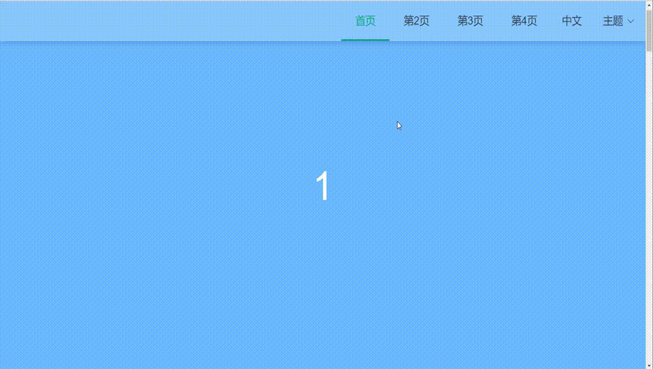

### Vue-template-web 使用vue element-ui的一个简单主页模板

#### 简介:
 此项目为一个简单的模板页面, 基础结构, 可方便改造成一些宣传页面,主题页面,官网页面等. 
 
 如: [这个网页](https://github.com/pjqdyd/Vue-bst-web)就是根据此模板的基础加了一点点细节☺得到的.

#### 项目实现: 

 **1. 双向绑定滚动锚点页面.**<br>
 **2. vue element-ui的i8n国际化支持.**<br>
 **3. 修改主题色theme.** <br>
 **4. vuex持久缓存用户的选择主题theme和语言language.**<br>
 **5. 使用了iconfont字体图标库.** <br>
 **6. 封装了一次axios请求.**<br>


#### 项目结构:
 ```
 src
  ├─assets                静态资源,图片,iconfont图标字体存放目录
  ├─components            公共组件目录
  ├─i18n                  vue element-ui的i8n国际化支持
  ├─router                路由模块
  ├─store                 vuex的模块,公共的state, mutations方法
  ├─utils                 工具类模块,包含http,本地缓存等.
  ├─views                 各个page页面的存放目录
  ├─App.vue               入口组件,挂载入口
  └─main.js               main入口js文件,引入全局使用的库、公共的样式和方法
 ```


#### 效果图:




#### 如何运行:

   -.将克隆项目下来(`git clone https://github.com/pjqdyd/Vue-template-web.git`).
   
   -.运行`npm install`下载依赖(如果下载慢:`npm install --registry=https://registry.npm.taobao.org`).
   
   -.运行`npm run serve`启动项目, 访问`http://localhost:8080`浏览页面.
   
   -.运行`npm run build`编译打包项目.

#### 注意:
1.新分支[Vue-template-web-cdn](https://github.com/pjqdyd/Vue-template-web/tree/Vue-template-web-cdn)使用了CDN来加载部分依赖, 防止了打包后js文件过大,首屏加载过久的问题.

 经测试:

    master分支运行npm run build后dist文件夹大小为_4M_左右;

    Vue-template-web-cdn分支打包后的dist文件夹减少至_100kb_左右;
    
因此建议使用Vue-template-web-cdn分支;
    
2.优化使用window.scrollTo(options)锚点滚动后, 注意浏览器的兼容性:[window.scrollTo兼容](https://developer.mozilla.org/en-US/docs/Web/API/Element/scrollTo), 当然你可以选择之前的提交版本的方式兼容其他浏览器;
   
#### 提示:
 
   1.项目实现了vue element-ui i8n国际化,中英文切换是定义了两套语言,在[i18n/langs/](./src/i18n/langs)下定义了.
   
   2.主题改变实现: 
   
   之前是参照[官方换肤案例](https://panjiachen.gitee.io/vue-element-admin-site/zh/guide/advanced/theme.html#%E6%A0%B7%E5%BC%8F%E8%A6%86%E7%9B%96)来实现的,可以连同ElementUI的组件一起改变颜色, 由于此种
   方式比较繁琐可能出现未知bug, 因此目前采用直接保存一个颜色值来改变主题,在项目中通过this.$store.state.theme可以获取主题色值.
   
   3.页面锚点滚动参照了[这个开源项目](https://github.com/ityadong/VueAnchor).
   
   4.项目封装了axios请求,并绑定了全局属性$globalRequest,在任意页面通过await this.$globalRequest.test4(arg);可以调用异步请求方法test4(),参考[代码](https://github.com/pjqdyd/Vue-template-web/commit/d96f0575937010ac3a4716b170c3f72c89adfd4d).
   
   5.如果项目发现可改进的地方欢迎提issue改进.
